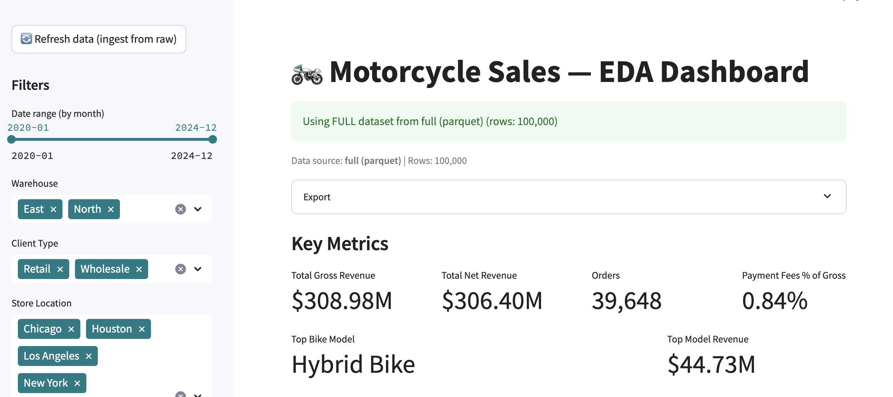
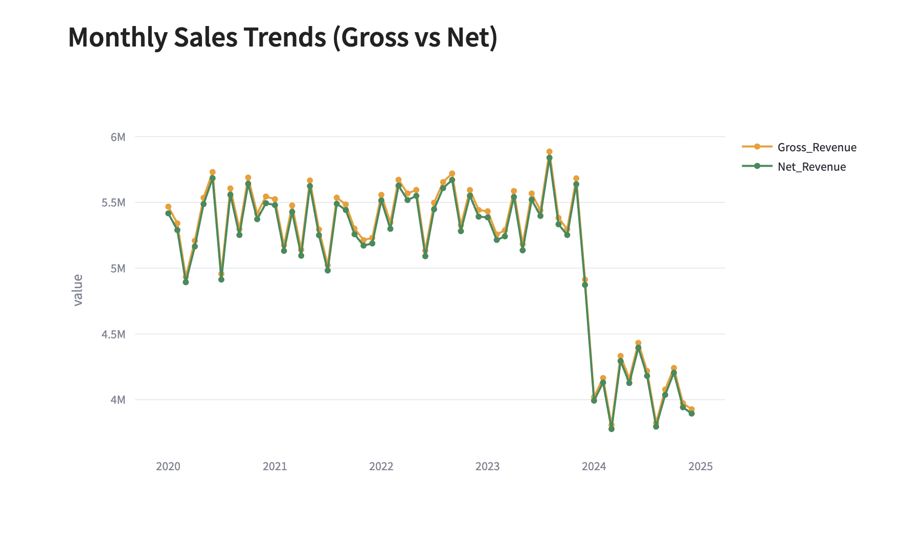
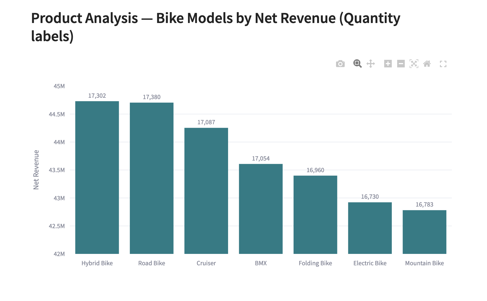

# Bike Sales Analysis

[](https://bikesalesanalysis-hrmyw3wkmeph4srfmctu7m.streamlit.app/)
[](https://github.com/abhistac/bike_sales_analysis/actions/workflows/ci.yml)

A portfolio project analyzing sales performance, customer segments, payment methods, warehouse performance, and product line profitability.

**Stack:** Python (pandas), DuckDB (SQL), Plotly/Matplotlib, Streamlit dashboard.

## Goals
- Compute **Net Revenue** after payment fees
- Compare **Retail vs Wholesale**
- Analyze **Payment Method** impact and **Warehouse** performance
- Visualize **time-series revenue trends**

## Data

- Full dataset (`data/raw/` and `data/processed/`) is ignored in GitHub to keep the repo lightweight.
- A **sample dataset** (`data/sample/bike_sales_sample.csv`) with ~500 rows is included for demo/reproducibility.
- To reproduce full results:
  1. Download the [100k Bike Sales dataset from Kaggle](https://www.kaggle.com/datasets/jayavarman/bike-sales-data-of-100k/data)
  2. Place it in `data/raw/`
  3. Run the ETL script:
     ```bash
     python -m src.etl.enrich
     ```

## Features

- **KPIs**
  - Total Gross Revenue
  - Total Net Revenue
  - Orders
  - Payment Fees % of Gross
  - Top Bike Model & Revenue
- **Visuals**
  - Monthly Sales Trends (Gross vs Net)
  - Product Analysis (Bike Models, quantities on bars)
  - Revenue by City
  - Revenue by Warehouse
  - Retail vs Wholesale by Payment Method
- **Extras**
  - Export filtered data as CSV
  - Continuous ingest with DuckDB (append + dedup)
  - Clean code with pre-commit hooks (Black, Ruff)

## Key Insights

- Hybrid Bikes contributed the highest revenue share (~25%).
- Credit Card was the most popular payment method, but also incurred the highest fees.
- The East warehouse consistently outperformed the North warehouse.
- Retail customers generated more orders, but wholesale clients contributed higher revenue per order.

## How to Run

1. Create a virtual environment and install requirements:
   ```bash
   python -m venv .venv
   source .venv/bin/activate
   pip install -r requirements.txt
   ```

2. Run enrichment to build processed dataset and DuckDB:
   ```bash
   python -m src.etl.enrich
   ```

3. Launch the Streamlit app:
   ```bash
   streamlit run app/streamlit_app.py
   ```

## Screenshots

### KPI Strip


### Trends


### Product Analysis

