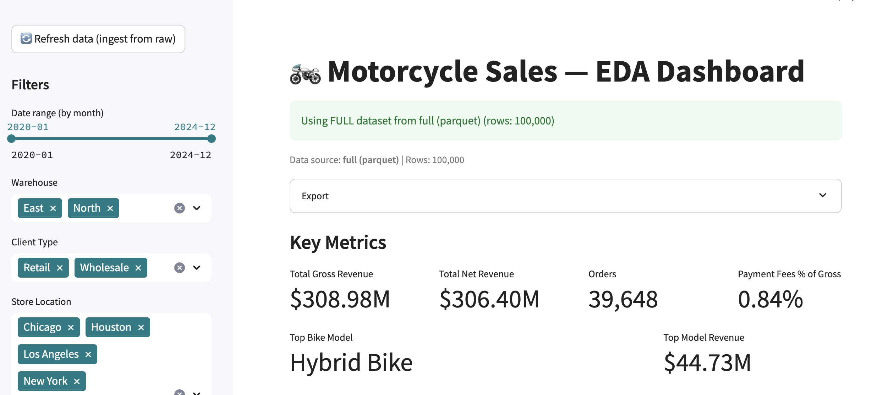
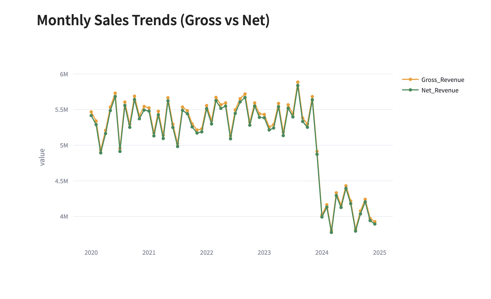
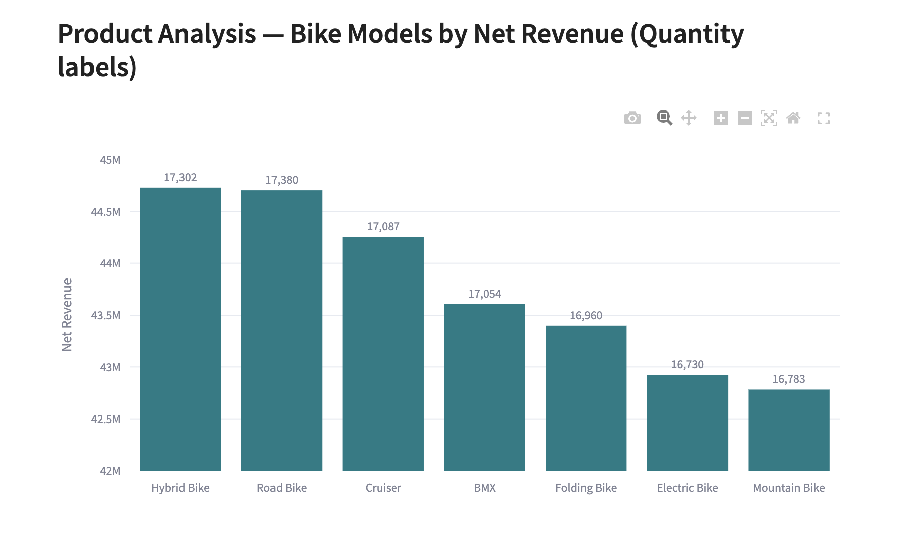

# Bike Sales Analytics

[](https://bikesalesanalysis-hrmyw3wkmeph4srfmctu7m.streamlit.app/)
[](https://github.com/abhistac/bike_sales_analysis/actions/workflows/ci.yml)

End-to-end sales analytics platform on 100K+ bike sales records. DuckDB for in-process SQL analytics, automated ETL with deduplication, pre-commit code quality hooks, GitHub Actions CI, and a live Streamlit dashboard.

**[→ Live Streamlit App](https://bikesalesanalysis-hrmyw3wkmeph4srfmctu7m.streamlit.app/)**

---

## What it does

Takes raw bike sales data and turns it into a live, interactive analytics platform:

- **Net Revenue analysis** — gross revenue minus payment processing fees by method
- **Retail vs Wholesale comparison** — order volume and revenue per order by channel
- **Warehouse performance** — East vs North throughput and revenue contribution
- **Product line profitability** — margin analysis across bike models
- **Time-series trends** — monthly gross vs net revenue with exportable filtered data

---

## Key findings

- Hybrid Bikes contributed ~25% of total revenue — highest share of any product line
- Credit Card was the most popular payment method but incurred the highest fee burden
- East warehouse consistently outperformed North on both order volume and revenue
- Wholesale customers generated fewer orders but higher revenue per order than retail

---

## Architecture

```
Raw CSV (Kaggle, 100K rows)
         │
         ▼
┌──────────────────────┐
│  src/etl/enrich.py   │  Clean, calculate net revenue, dedup, load to DuckDB
└────────┬─────────────┘
         │
         ▼
┌──────────────────────┐
│  DuckDB (local)      │  In-process OLAP — fast analytical SQL without a server
└────────┬─────────────┘
         │
         ▼
┌──────────────────────┐
│  app/streamlit_app   │  KPI strip · Trends · Products · Warehouses · Export
└──────────────────────┘

CI: GitHub Actions runs tests on every push
Code quality: pre-commit (Black + Ruff) on every commit
```

---

## Quick start

```bash
git clone https://github.com/abhistac/bike_sales_analysis.git
cd bike_sales_analysis

python -m venv .venv && source .venv/bin/activate
pip install -r requirements.txt

# Download dataset from Kaggle:
# https://www.kaggle.com/datasets/jayavarman/bike-sales-data-of-100k
# Place in data/raw/

python -m src.etl.enrich       # Build DuckDB + processed dataset
streamlit run app/streamlit_app.py
```

---

## Dashboard screenshots

### KPI strip


### Revenue trends


### Product analysis


---

## Stack

Python · DuckDB · Streamlit · Plotly · Pandas · GitHub Actions · pre-commit (Black + Ruff) · pytest

---

## Why DuckDB instead of Pandas for analytics?

DuckDB runs SQL directly on Parquet and CSV files in-process — no database server needed, no data movement, faster aggregations on large files than Pandas groupby. For an analytics workload on 100K+ rows with frequent aggregations by multiple dimensions, it's meaningfully faster and the SQL is easier to read and maintain than chained Pandas operations.

---

## Author

**Abhista Atchutuni** — AI & Data Engineer
[linkedin.com/in/abhistac](https://linkedin.com/in/abhistac) · [abhistaca@gmail.com](mailto:abhistaca@gmail.com) · [abhistac.github.io](https://abhistac.github.io)
